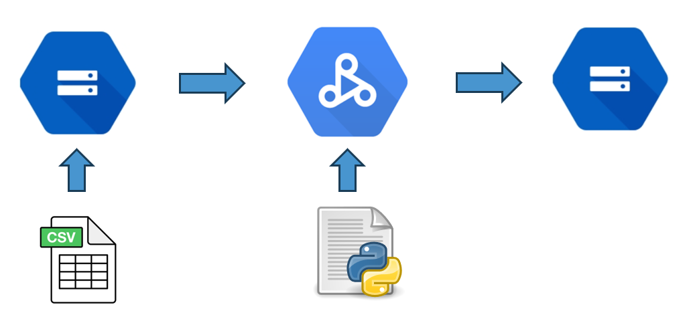

# Brewery Sales Forecasting🍺

## Project Overview
This project involves forecasting total sales for a brewery using a dataset from Kaggle. The models used for forecasting include Linear Regression, Random Forest, and Decision Tree. The project has been executed and tested on Google Cloud Platform's DataProc service.

## Dataset
The dataset used in this project can be found at [Kaggle Brewery Operations and Market Analysis Dataset](https://www.kaggle.com/datasets/ankurnapa/brewery-operations-and-market-analysis-dataset/). It provides extensive data related to brewery operations and market analysis, which is suitable for developing predictive models.

## Requirements
- Google Cloud Platform account
- Access to GCP DataProc
- Apache Spark
- PySpark
- Python 3.x

## Installation and Setup
1. **Set up GCP DataProc Cluster:**
   Ensure that you have a GCP account and create a DataProc cluster to run PySpark jobs.

2. **Install PySpark:**
   ```bash
   pip install pyspark
    ```
## Download the Dataset:
Download the dataset from [Kaggle](https://www.kaggle.com/datasets/ankurnapa/brewery-operations-and-market-analysis-dataset/) and upload it to a bucket in Google Cloud Storage accessible by your DataProc cluster.

## EDA
Refer to `notebooks/Brewery data analysis.ipynb` and [databricks notebook](https://databricks-prod-cloudfront.cloud.databricks.com/public/4027ec902e239c93eaaa8714f173bcfc/5182382688665269/526089589527995/7916894787093757/latest.html )

## Models Used

* **Linear Regression:** A basic model for establishing a baseline in forecasting performance. Refer to `brewery_pyspark_lr.py`
* **Random Forest:** An ensemble model that uses multiple decision trees to improve the predictive accuracy and control over-fitting. Refer to `brewery_pyspark_rf.py`
*  **Decision Tree:** A model that splits the data into subsets while at the same time developing a corresponding decision tree. The final decision tree can be used to make predictions. Refer to `brewery_pyspark_dt.py`

## Training:
* Initialize SparkSession
* Load dataset
* Drop duplicates and NAs
* Cast the target variable to Float
* Split DateTime column into Year, Month and Day
* Convert categorical columns to numeric values or one hot encoding-Linear Regression
* Initialize VectorAssembler
* Initialize Model
* [Optional] Initialize params for grid search
* [Optional] Initialize the CrossValidator along with metric
* Train the model
* Initialize evaluator
* Compute RMSE and R squared

## Parameter Selection
`brewery_pyspark_rf_grid.py`

## Results

RMSE: 2486
